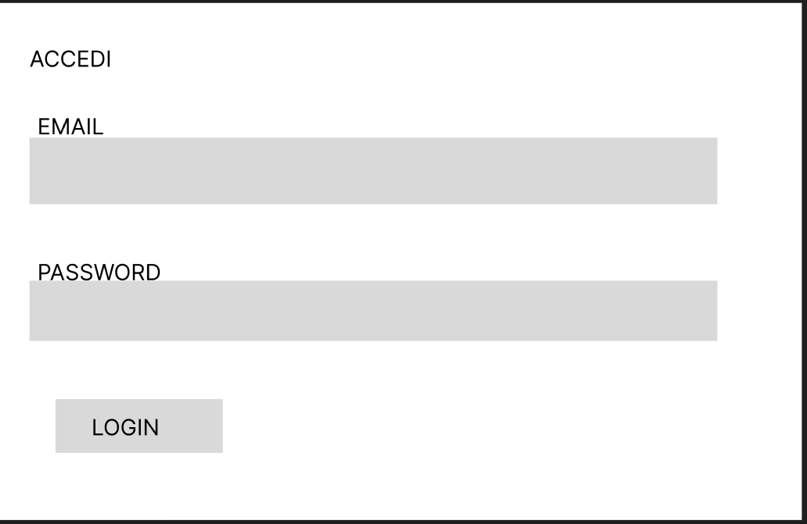
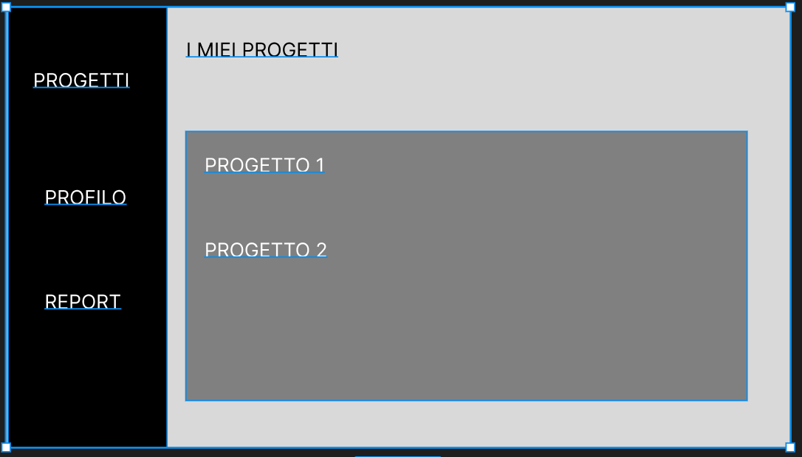
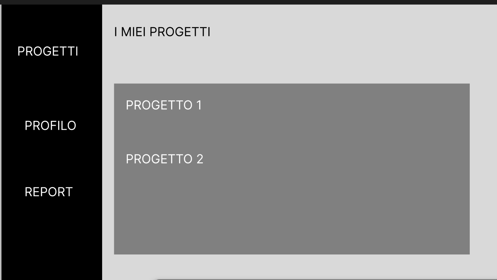
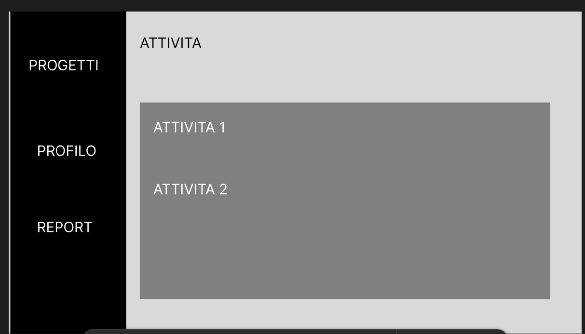
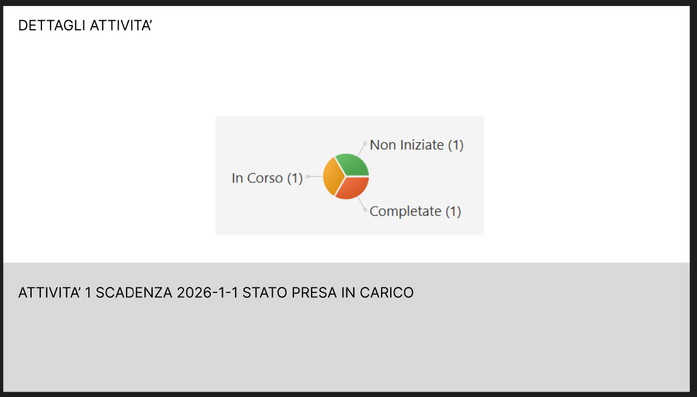

# 🎓 UninaTaskBoard

**Progetto per gli esami di Programmazione Object Oriented e Basi di Dati**
*Università degli Studi di Napoli Federico II - Corso di Laurea in Informatica (A.A. 2026/2027)*

UninaTaskBoard è un'applicazione software desktop sviluppata in **JavaFX** supportata da un solido backend relazionale in **PostgreSQL**. Il sistema simula una piattaforma collaborativa per la gestione strutturata di progetti, task operativi e flussi documentali, pensata per l'ecosistema accademico.

## ✨ Funzionalità Principali

*   **Pattern EBC (Entity-Boundary-Control):** Netta separazione tra interfaccia grafica, logica di business e persistenza dei dati.
*   **Gestione Documentale (BYTEA):** Upload e download di file fisici serializzati in stream di byte e salvati in modo sicuro direttamente nel database.
*   **Versionamento Automatico:** Mantenimento dello storico delle revisioni dei file.
*   **Integrità dei Dati:** Utilizzo estensivo di tipi di dato personalizzati (ENUM) in PostgreSQL (es. `stato_attivita`) per prevenire anomalie.
*   **Statistiche Attività:** Generazione dinamica di grafici in base allo stato d'avanzamento dei task.

---

## 🎨 Mockup e Interfaccia (UI/UX)
L'interfaccia utente è stata progettata partendo da mockup ad alta fedeltà per garantire un'esperienza pulita e reattiva. Di seguito le schermate principali del sistema:

### 1. Autenticazione
Schermata di login per l'accesso sicuro tramite credenziali universitarie.

### 2. Dashboard Principale
Layout strutturato con Sidebar laterale per la navigazione rapida tra i moduli del sistema.

### 3. Gestione Progetti
Vista aggregata per consultare e gestire i progetti assegnati all'utente.

### 4. Dettaglio Attività (Task)
Pannello per la gestione granulare delle attività, con funzionalità di inserimento, cambio di stato e gestione dei file allegati.

### 5. Statistiche
Visualizzazione analitica dell'andamento dei progetti tramite componenti grafici interattivi.

---

## 🛠️ Tecnologie Utilizzate
*   **Linguaggio:** Java 
*   **GUI Framework:** JavaFX
*   **Database:** PostgreSQL
*   **Connettività:** JDBC
*   **Version Control:** Git & GitHub

---

Per eseguire correttamente l'applicativo in ambiente locale:

1. **Configurazione PostgreSQL:**
   * Creare un database vuoto chiamato `unina_taskboard`.
   * Creare un'utenza con username `OO8` e password `password`, garantendole tutti i privilegi sul database.
2. **Generazione Schema:**
   * Eseguire lo script `database.sql` allegato nella root del progetto per generare lo schema relazionale, gli ENUM, il Trigger e i dati di test.
3. **Avvio Applicativo:**
   * Compilare ed eseguire il progetto Java.
   * *Opzionale:* Per utilizzare credenziali del server diverse, modificare le costanti `USER` e `PASSWORD` nel file `src/control/ConnessioneDatabase.java`.
4. **Credenziali di Test (Login):**
   * **Email:** `mario.rossi@studenti.unina.it`
   * **Password:** `password123`

---
**Autori:**
* Vincenzo Angelino 
* Pasquale Aucelli
